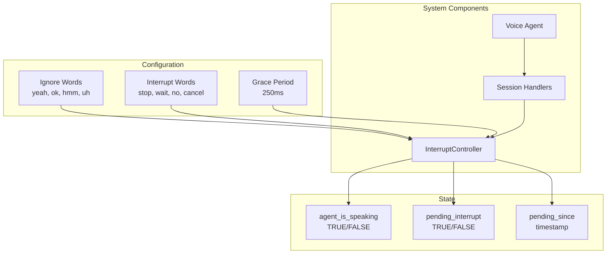
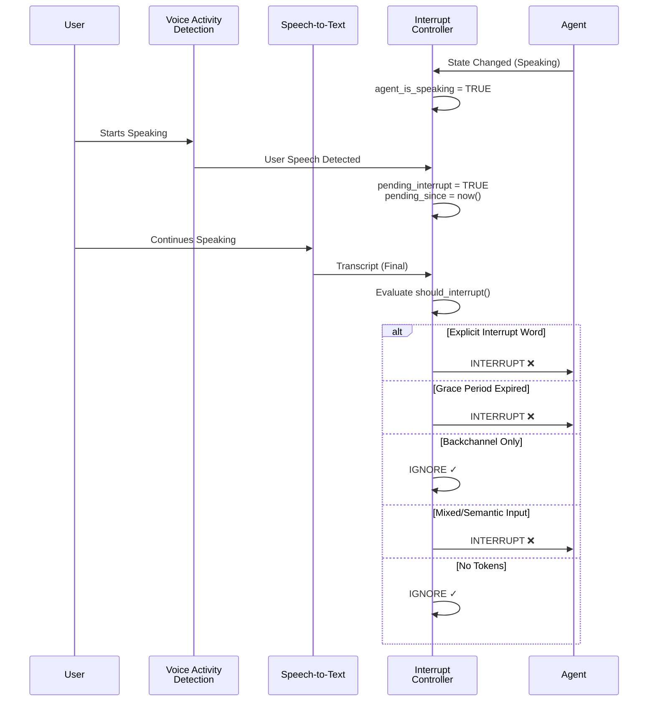
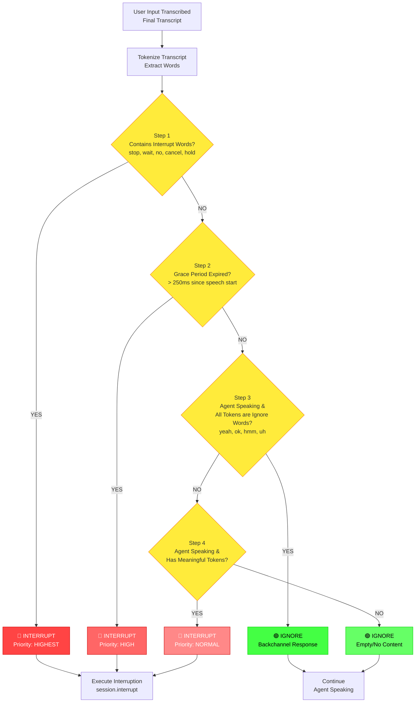
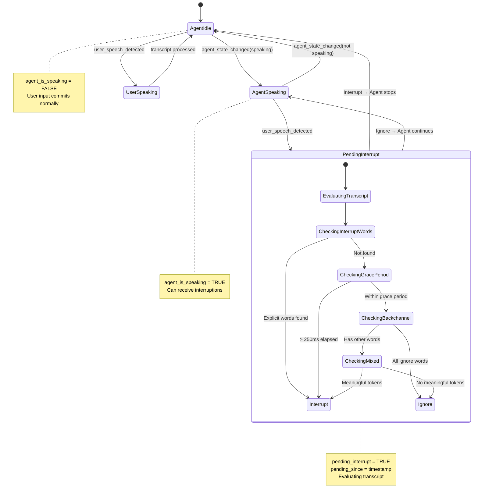
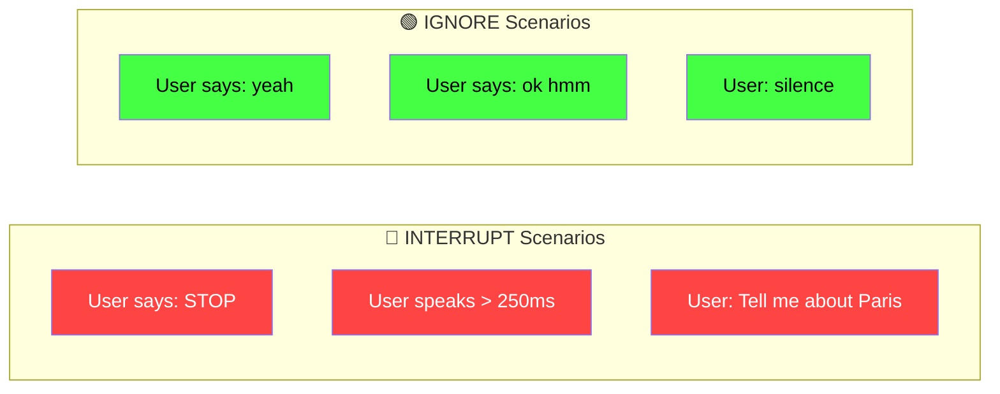

# Interrupt Handler Flow Diagram

This document visualizes the flow of the interrupt handler system used in the voice agent application.

## Overview

The interrupt handler manages user interruptions during agent speech, distinguishing between meaningful interruptions and backchannel responses (like "yeah", "ok", "hmm").

## Architecture Overview



## Event Flow



## Interrupt Decision Logic



## State Machine



## Component Breakdown

### 1. System Components

| Component | Responsibility |
|-----------|---------------|
| **InterruptController** | Core logic for evaluating interruptions |
| **Session Handlers** | Connects events to interrupt controller |
| **Voice Agent** | Main agent orchestrating the conversation |

### 2. Configuration Parameters

| Parameter | Value | Purpose |
|-----------|-------|---------|
| **ignore_words** | `yeah`, `ok`, `okay`, `hmm`, `uh`, `uh-huh`, `aha`, `right`, `correct` | Backchannel words that don't interrupt |
| **interrupt_words** | `stop`, `wait`, `no`, `cancel`, `hold` | Explicit commands that force interruption |
| **grace_ms** | `250ms` | Time window before treating speech as interruption |

### 3. State Variables

| Variable | Type | Description |
|----------|------|-------------|
| **agent_is_speaking** | Boolean | Tracks if agent is currently speaking |
| **pending_interrupt** | Boolean | Marks when user speaks during agent speech |
| **pending_since** | Timestamp | Records when user started speaking |

### 4. Decision Priority Levels

The system evaluates interruptions in this cascading order:

```
Priority 1: EXPLICIT INTERRUPT WORDS (stop, wait, no, cancel, hold)
    ↓ If not found
Priority 2: GRACE PERIOD CHECK (> 250ms elapsed)
    ↓ If within grace period
Priority 3: BACKCHANNEL DETECTION (all words are yeah/ok/hmm)
    ↓ If has other words
Priority 4: MIXED/SEMANTIC INPUT (meaningful conversation)
    ↓ If no meaningful tokens
Result: IGNORE (empty or silence)
```

### 5. Event Processing Flow

**Step 1**: Agent State Monitoring
- Listens to `agent_state_changed` and `speech_created` events
- Updates `agent_is_speaking` flag

**Step 2**: User Speech Detection
- Captures `user_input_transcribed` events
- Sets `pending_interrupt` if agent is speaking

**Step 3**: Transcript Evaluation
- Tokenizes the user's transcript
- Applies decision logic cascade

**Step 4**: Action Execution
- **Interrupt**: Calls `session.interrupt()` to stop agent
- **Ignore**: Allows agent to continue speaking

## Visual Summary

### Interrupt vs Ignore Scenarios



## Color Legend

- 🔴 **Red**: Interrupt actions - agent speech is canceled
- 🟢 **Green**: Ignore actions - agent continues speaking
- 🟡 **Yellow**: Decision points - conditional logic
- 🔵 **Blue**: System components and state

## Implementation Files

- **interrupt_controller.py**: Core interrupt logic and decision-making
- **session_handlers.py**: Event handler registration and coordination
- **history_agent.py**: Main agent implementation using the interrupt controller

## Usage Example

```python
# Initialize the interrupt controller
interrupt_controller = InterruptController(
    ignore_words={"yeah", "ok", "hmm"},
    interrupt_words={"stop", "wait", "no"},
    grace_ms=250
)

# Register event handlers
register_interrupt_handlers(session, interrupt_controller, logger)
```
